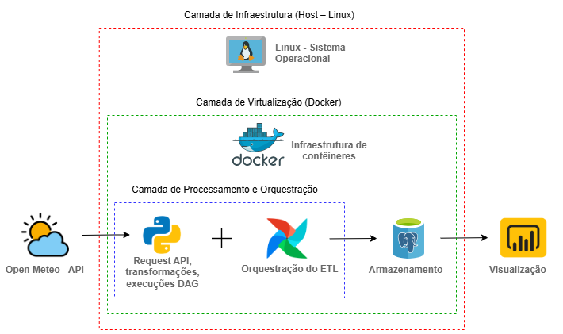
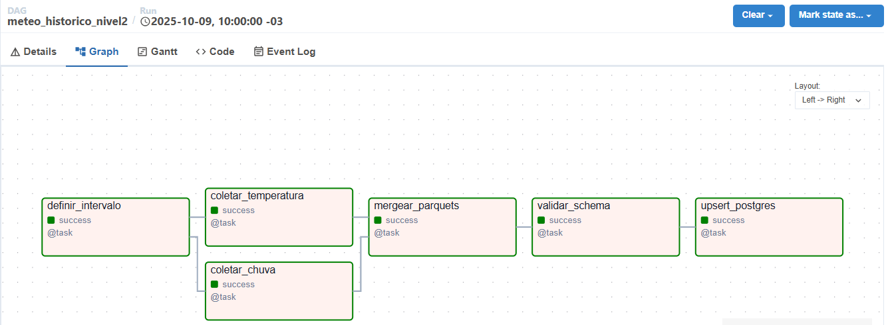

# Arquitetura do Pipeline Meteorológico (Airflow + Docker + Python + Postgres + Power BI)

## 1️⃣ Objetivo

Este projeto implementa um **pipeline de dados meteorológicos** desenvolvido em **Python e Apache Airflow**, com integração à **API Open-Meteo** para coleta de informações de **temperatura e precipitação** em capitais brasileiras.

A arquitetura foi projetada para simular um fluxo **real de engenharia de dados**, com:
- **Orquestração de tarefas** via Airflow (usando Docker)
- **Ingestão incremental** e carga histórica automatizada
- **Persistência de dados** no banco PostgreSQL
- **Armazenamento intermediário** em formato Parquet

O objetivo é demonstrar, de forma prática, como construir uma DAG completa — desde a **extração de dados brutos via API**, até a **carga estruturada em banco de dados relacional**, dentro de um ambiente **containerizado e reproduzível**.

## 2️⃣ Arquitetura

(diagrama + explicação das camadas)

 

## 3️⃣ DAGs e Tasks
Listagem e explicação de cada task.

 

## 4️⃣ Observabilidade
Logs, validação, retries, tempo de execução, alertas.

## 5️⃣ Governança e Data Quality
Como o pipeline garante integridade, schema e histórico.

## 6️⃣ Infraestrutura
Serviços do Docker Compose e volumes.

## 7️⃣ Execução e Agendamento
Como rodar manualmente e como o cron diário foi configurado.

### ▶️ Execução manual da DAG (últimos 6 meses)

## 8️⃣ Próximos Passos
Melhorias futuras (Data Lake, alertas, dashboard).

---

## 📊 Observabilidade e Logs

Cada task possui logging estruturado com informações de início, fim e volume de dados processados.

Exemplo de trecho de log (Airflow UI → Task → Logs):

---