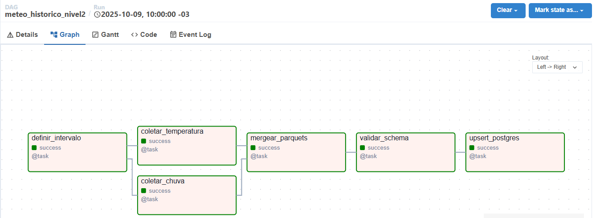

# Arquitetura do Pipeline Meteorológico (Airflow + Docker + Python + Postgres + Power BI)


## 1️⃣ Objetivo

Este projeto implementa um **pipeline de dados meteorológicos** desenvolvido em **Python e Apache Airflow**, com integração à **API Open-Meteo** para coleta de informações de **temperatura e precipitação** em capitais brasileiras.

O pipeline realiza:
- 🔄 **Orquestração automática** das tarefas via Airflow  
- ☁️ **Coleta de dados** da API pública **Open-Meteo** (temperatura, precipitação, etc.)  
- 🧮 **Transformações e validações** com Python  
- 🗄️ **Armazenamento** dos resultados em banco de dados PostgreSQL  
- 📊 **Integração com Power BI** para visualização dos dados

# 🌤️ Pipeline Meteorológico (Airflow + Docker + Python)

Este repositório demonstra a construção de um pipeline de dados meteorológicos usando **Apache Airflow** dentro de um ambiente **containerizado com Docker**.

---

## 🚀 Tecnologias
- Python  
- Apache Airflow  
- Docker & Docker Compose  
- PostgreSQL  
- Open-Meteo API  
- Power BI (consumo dos dados)

---

## 📁 Estrutura do projeto

```bash
api_clima/
├── docker-compose/
│   └── docker-compose.yml
├── img/
│   ├── projeto.png
│   └── dag.png
├── scripts/
│   └── meteo_pipeline.py
├── README.md
└── requirements.txt
```


O objetivo é demonstrar, de forma prática, como construir uma DAG completa — desde a **extração de dados brutos via API**, até a **carga estruturada em banco de dados relacional**, dentro de um ambiente **containerizado e reproduzível**.

## 2️⃣ Arquitetura

A arquitetura reflete um fluxo real de Engenharia de Dados, com ingestão incremental, controle de histórico e modularização das etapas (ingestão, processamento e persistência).


## 3️⃣ DAGs e Tasks

A DAG principal (`meteo_historico_nivel2`) realiza o fluxo ETL completo:



### Principais Tasks
- `extract_openmeteo`: coleta dados da API
- `transform_data`: normaliza e aplica validações básicas
- `load_to_postgres`: insere no banco de dados
- `check_quality`: valida a integridade e formato dos dados


## 4️⃣ Observabilidade

- Monitoramento de execução via **Airflow UI**
- Logs estruturados por task com timestamp, volume e status
- Política de **retries automáticos** e alertas de falha (configurável)

## 5️⃣ Governança e Data Quality
Como o pipeline garante integridade, schema e histórico.

## 6️⃣ Infraestrutura
Serviços do Docker Compose e volumes.

## 7️⃣ Execução e Agendamento
Como rodar manualmente e como o cron diário foi configurado.


### ▶️ Execução manual da DAG (últimos 6 meses)

Para executar manualmente a DAG `meteo_historico_nivel2` e coletar dados dos últimos seis meses, utilize o comando abaixo no terminal:

```bash
docker exec -it airflow-airflow-scheduler-1 bash -lc \
  "airflow dags trigger meteo_historico_nivel2 \
   --conf '{\"start\":\"2025-04-23\",\"end\":\"2025-10-23\"}'"
```

   
💡 Explicação rápida:

- docker exec -it airflow-airflow-scheduler-1 bash -lc → acessa o container do scheduler do Airflow.
- airflow dags trigger meteo_historico_nivel2 → dispara manualmente a DAG.
- --conf → passa as datas de início e fim do intervalo para o script dentro da DAG.

As datas aqui cobrem os últimos seis meses (23/04/2025 → 23/10/2025).

## 8️⃣ Próximos Passos
Melhorias futuras (Data Lake, alertas, dashboard).


